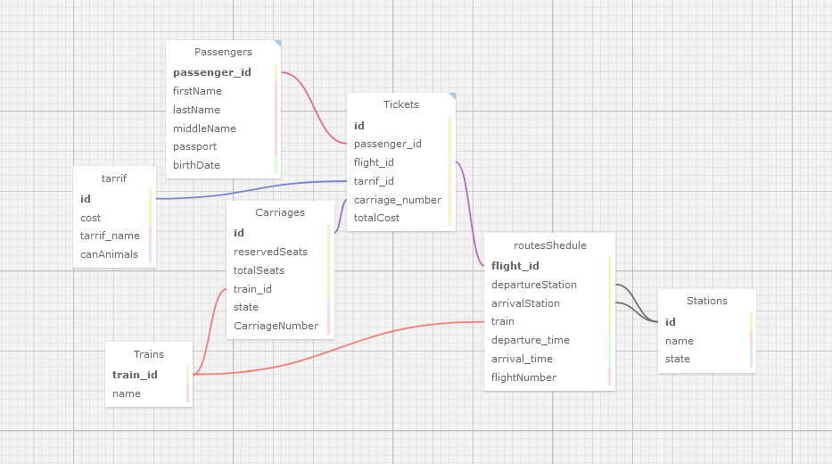

# Station Accounting System

Учебный пример системы ведения учета на вокзале. 

*Задача*: разработка клиент-серверного приложения для управления пассажироперевозками на железнодорожном вокзале.

База данных представляет из себя 7 таблиц с информацией, обычно использующейся на Ж/Д вокзалах и справочных центрах.
Для управления базой данных реализована система ролей:
+ Администратор
    + Может изменять все таблицы
+ Пользователь
    + Может изменять только таблицы "Билеты" и "Пассажиры"

## Технологии:
+ Qt5
+ PostgreSQL + PgAdmin
+ Docker 

## Требования
+ Наличие драйвера *QPSQL*База данных представляет из себя 7 таблиц с обычно использующейся на Ж/Д
вокзалах и справочных центрах
+ Наличие *yaml-cpp*
+ Путь для сборки приложения в QtCreator: `~/src/station_accounting_system/build/Desktop-Debug`
    + или путь такой же глубины
+ В `config.yaml` следует прописать IP-адрес докер-контейнера postgres-sa-system
+ Для подключения к PgAdmin использовать учетную запись по умолчанию (*postgres*), пароль для нее можно поставить в `docker-compose.yml`

## Структура базы данных
